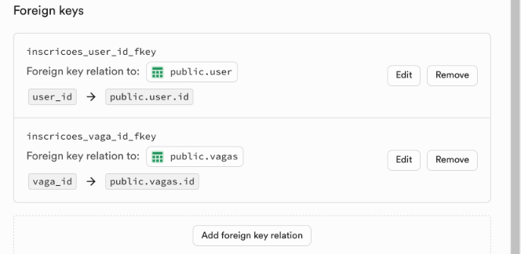
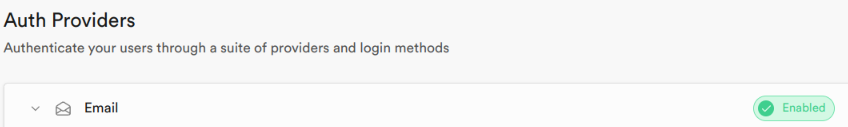
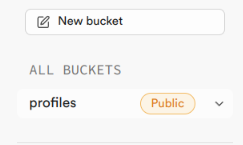

# Aplicativo mobile "Consultar vagas"

__Projeto universitário extesionista.__

## Descrição

O mercado de trabalho para jovens estudantes ou recém-formados se encontra atualmente em um cenário bastante desafiador para a primeira oportunidade. Cada vez mais são exigidas qualificações e experiências para vagas de estágio ou nível júnior, o que torna o desafio ainda maior. Assim, quando o estudante animado e entusiasmado localiza uma vaga adequada, frequentemente se depara com uma vaga fantasma que aparenta ser um cargo interessante, mas que, na verdade, tem como objetivo apenas a coleta de dados.

Foi com base nesses problemas que o aplicativo mobile “Consulta Vagas” foi desenvolvido. Com o intuito de democratizar a burocracia de procurar uma vaga, ele traz uma usabilidade simples, mas poderosa e eficaz, com o objetivo de facilitar a entrada do estudante talentoso no mercado de trabalho.

Este aplicativo foi desenvolvido utilizando React Native e Supabase para oferecer uma experiência de usuário intuitiva e eficiente, permitindo aos estudantes encontrar oportunidades de trabalho genuínas e se candidatar a elas de maneira direta e segura.

 
 

## Funcionalidades

### Principais funcionalidades:

### __Usuario__

| Usuário |                 |            |
|-----------|-------------------------|--------------|
| - Criação de cadastro               |              |
| - Login                             |              | 
| - Visualização de vaga disponível   |              | 
| - Inscrição pra vaga desejada       |              | 

### __Admin__

| Administrador |                 |                  |
|-----------|-------------------------|--------------|
| - Login com credencias estáticos    |              |
| - Visualização de vagas disponíveis |              | 
| - Criação de vaga                   |              | 
| - Alteração de vaga                 |              | 
| - Remoção de vaga                   |              | 

 

### __Diagrama funcional__: [Diagrama Mobile](midia_app/Diagrama%20Mobile.pdf)

 

## Ilustração do Aplicativo

[Clique aqui pra visualizar as imagens do app](midia_app/caputura_telas.md)

[Vídeo ilustrativo do funcionamento do aplicativo](https://github.com/Tfonseca200/Projeto-PMA/blob/main/midia_app/video_ilustrativo.mp4)

 
 

## Tecnologia utilizadas

- IDE Snack Expo
- React Native
- Supabase

 
 

## Instalação

### Pré-requisitos

- Conta criada no Expo
- Conta criada no supabase

### Passo a Passo

### Expo

1. cria um projeto Snack dentro do ambiente Expo
2. Clone esse repositório 
3. Impota o projeto na sua IDE snack dentro do Expo
4. Provavelmente aparecerá um botão dizendo " add export ",   clique nele pra injetar as depências necessarias do projeto

### Supabse

1. Cria um novo projeto no Supabase
2. pra integração da API do supabase precisa entra na configuraçõee do projeto e copiar a Url e chave da API do projeto.

- entra no projeto
- acesse project settings
- acesse API (os dados estará disponivel na aba "__PROJECT URL"__ e __"PROJECT API Keys"__ )

3. Adiciones sua Url e chave da Api nessa parte do codigo -> [Integração com o Supabase](src/Services/supabase.js)

### Banco de dados

tabelas com nome e tipo de dados que você precisar criar

### tabela - __user__

| coluna |  Tipo de dado     |            |
|-----------|--------------|-------------|
| id        |   int8       | 
| nome      |   varchar    | 
| cpf       |   varchar    |
| email     |   varchar    |
| pdfUrl    |   text       | 
| auth_user_id  |   UUID      |

### tabela - __vagas__

| coluna |  Tipo de dado     |            |
|-----------|--------------|-------------|
| id        |   int8       |
| titulo    |   varchar    | 
| empresa   |   varchar    |
| descricao |   varchar    |

### tabela - __inscricoes__ (tabela de relacionamento da tabela user e vagas (n - n))

| coluna |  Tipo de dado     |            |
|-----------|--------------|-------------|
| id        |   int8       |
| user_id   |   int8       |
| vagas_id  |   int8       |

- user_id é o id do usuario da tabela user

- vagas_id é o id da vaga da tabela vagas

 
 

### Image demostrativa do relacionamento

### Authentication

Cria uma autenticação de email como users

### Storage

Cria um bucket como o nome profiles( aqui que será guardados os curriculos)

### Observação

Lembre-se de definir a política de RLS de acordo com o seu projeto

mais esclarecimento segue a documentação do supabase: __[Docs Supabase](https://supabase.com/docs)__

